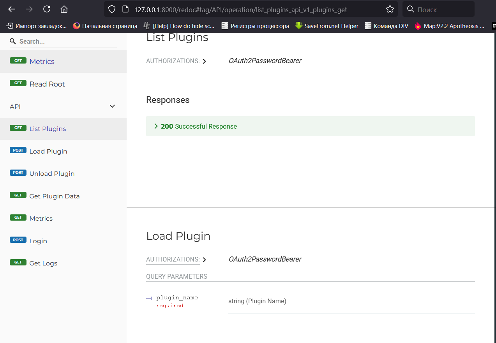

# ESB
Aviation* Enterprise service bus fork from classical ESB

### EN
Project Enterprise service bus.

### RU
Проект корпоративной шины данных

## Конфигурационные файлы

Проект использует конфигурационные файлы для управления настройками и поведением. Ниже приведены детали каждого файла конфигурации, их расположение и то, что они настраивают.

### 1. `plugins_config.json`
- **Расположение**: `app/plugins/plugins_config.json`
- **Назначение**: Определяет список доступных плагинов и их конфигурацию для шедулинга.
- **Структура**:
  ```json
  {
      "plugins": ["system_a", "system_b"],
      "scheduled_plugins": {
          "system_a": {"interval": "5 minutes"},
          "system_b": {"interval": "1 hour"}
      }
  }
**Описание:**
**plugins:** Массив имен плагинов (например, system_a, system_b), которые доступны для загрузки. Плагины из этого списка будут сканироваться и загружаться при старте, если их директории существуют в app/plugins/.
**scheduled_plugins:** Словарь, где ключ — имя плагина, а значение — объект с полем interval, указывающим интервал шедулинга (например, "5 минут", "1 час", "30 секунд", "2 дня"). Только плагины, указанные здесь, будут периодически выполняться планировщиком. Если плагин не включен в этот раздел, он не будет запланирован.
Примечания: Формат interval обрабатывается apscheduler's IntervalTrigger.from_string, поддерживающим единицы времени, такие как секунды, минуты, часы и дни. Убедитесь, что директория плагина (например, app/plugins/system_a/) содержит файл __init__.py.


### Redoc example


